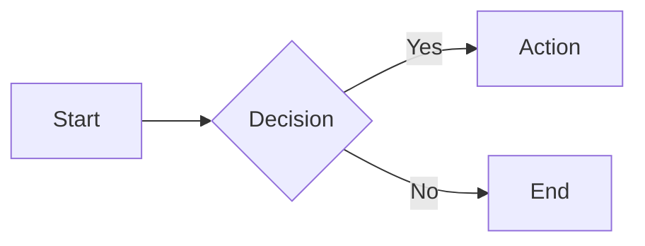
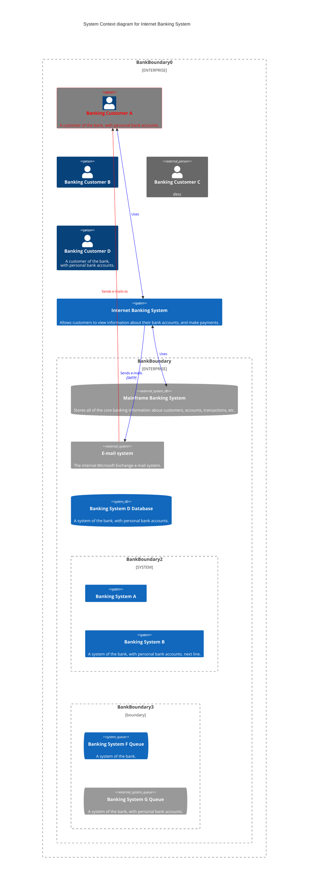

# Architectural Description Document (ADD)

## 1. Introduction
Test

An architectural description shows the system as a multifaceted structure, not just the technical underpinnings of the software. It attempts to communicate understanding the system through multiple viewpoints, like the business, operational, and social perspectives, allowing engineers and architects to craft an architecture that balances various stakeholder needs. By employing this viewpoint-driven approach, the architectural design equips software architects with an approach to designing systems that are not just technically sound, but also aligned with the bigger picture, ensuring stakeholder satisfaction and long-term success.  Although principally intended as a design tool, the architectural description can also provide a means of documenting the system with different views for different stakeholders.

[Help on Markdown language can be found here - https://www.markdownguide.org/ .]: #
[Help on Mermaid (used to create the diagrams) can be found here - https://mermaid.js.org/ .]: #
[Details on C4 models can be found here - https://c4model.com/ .]: #

> _Briefly introduce the system and its purpose_

### Scope

> _State the scope of the architectural description._

### Stakeholders

| Stakeholder Class | Name \ Group            | Business | Functional  | Development | Deployment | Implementation | Evolution | Security | Quality |
| :---              | :---                    |:---:     | :---:       | :---:       | :---:      | :---:          | :---:     | :---:    | :---:   |
| Business Sponsor  | ?                       |✔️         | ✔️        | ❌         | ❌         | ❌              | ✔️      | ✔️       | ✔️     |
| IT Sponsor        | ?                       |✔️         | ✔️        | ❌         | ❌         | ✔️              | ✔️      | ✔️       | ✔️     |
| Users             | ?                       |✔️         | ❌        | ❌         | ❌         | ❌              | ✔️      | ❌       | ❌     |
| Developers        | ?                       |✔️         | ✔️        | ✔️         | ✔️         | ✔️              | ✔️      | ✔️       | ✔️     |
| Suppport Staff    | ?                       |✔️         | ✔️        | ❌         | ❌         | ❌              | ❌      | ✔️       | ✔️     |
| Testers           | ?                       |✔️         | ✔️        | ❌         | ❌         | ❌              | ❌      | ✔️       | ✔️     |
| IT Security       | ?                       |✔️         | ✔️        | ❌         | ❌         | ❌              | ❌      | ✔️       | ✔️     |

## 2. Business Viewpoint

### Goals & Objectives

> _Describe the business goals and objectives that the system is intended to achieve._

### Key Business Processes

> _Identify the key business processes and their relationship to the system. Consider using business process diagrams (see below)._

### Non-Functional Requirements

> _Define the system's non-functional requirements (performance, security, scalability, etc.)._

### Business Constraints And Assumptions

> _Outline the business constraints and assumptions that influence the architecture._

# 3. Functional Viewpoint

## High-Level Architectural Overview

> _Specify the interfaces between the system and its external environment.  Consider usng a C4 context diagram (see below)._

## 4. Element View
<ins>**4.1 The Context Viewpoint**</ins>
<ins>Accessibility</ins>
* Is there any requirements for the system to interface with specialist devices for use by people with disabilities?

<ins>Development Resource</ins>
* Are there any resource constraints (short timescales / Limitations on available skills / etc)?   

<ins>Evolution</ins> 
* Describe the system's adaptability to meet future needs.
* Identify the potential growth areas and performance requirements for the future.

<ins>Performance and Scalability</ins>
* Describe what will affect performance (how quickly it runs) and drawback of any change in performance.
* Describe the system's scalability to meet future needs.
* Document the process for addressing potential architectural changes and modifications.

<ins>Regulation</ins>
* Are there any requirements to interface with internal or external auditing or regulatory reporting systems.
    
<ins>**4.2 The Functional Viewpoint**</ins>
<ins>Availability and Resilience</ins>
* Are Functional changes required to support availability requirements, (offline mode when communications network is not available)?

<ins>Development Resource</ins>
* Define the system's main functions and their interactions.
* Specify the interfaces between the system and its external environment.
* Are there any resource constraints that could impose restrictions on functionality and on functional qualities such as generality?    

<ins>Evolution</ins> 
* Describe the system's adaptability to meet future needs with regards to functionality.
* Identify the potential growth areas and performance requirements for the future with regards to functionality.

<ins>Performance and Scalability</ins>
* Describe the system's scalability to meet future needs.
* Document the process for addressing potential architectural changes and modifications.

<ins>Regulation</ins>
* What impact does the regulation (if any) have on what the system does and how it works?

<ins>Usability</ins>
* What are all places where people may interact with the system (touch points)?
* How will users interact with the system at each touch point?

<ins>**4.3 The Information Viewpoint**</ins>
<ins>Availability and Resilience</ins>
* What are the processes and systems for backup and recovery. 
* Systems must be backed up in such a way that they can be recovered in a reasonable amount of time if a disaster occurs.
* Backups should not impact online availability, or if they do, they may need to be scheduled to occur outside the online day. 

<ins>Development Resource</ins>  
* Is there any requirement for specialists’ staff?
* Is there a requirement for a larger than normal team?
* Identify the data flows and data structures within the system.

<ins>Performance and Scalability</ins>
* Describe the system's scalability to meet future needs.
* Document the process for addressing potential architectural changes and modifications.

<ins>Regulation</ins>
* What regulations are there which relate to the retention, use and manipulation of personal information? 
* How will the regulations impact following with the use of the personal information? 
* Privacy, Access control, Retention and archive, Audit, Availability, Distribution

<ins>Security</ins>
* Describe the security requirements, policies, and measures implemented in the system relating to data.
* Identify potential security threats and vulnerabilities relating to data..
* Outline the security controls and safeguards to protect the system and its data.
* Document the procedures for managing security incidents and breaches relating to data..

<ins>**4.4 The Concurrency Viewpoint**</ins>
<ins>Development Resource</ins>  
* How much time will be required for Development?
* How much time will be required for Testing?

<ins>Evolution</ins> 
* Describe the system's adaptability to meet future needs relating to concurrency.
* Identify the potential growth areas and performance requirements for the future relating to concurrency.

<ins>Performance and Scalability</ins>
* Describe the system's scalability to meet future needs.
* Document the process for addressing potential architectural changes and modifications.

<ins>**4.5 The Development Viewpoint**</ins>
<ins>Availability and Resilience</ins>
* What design constraints could there be on the software modules? For example, all subsystems may have to support start, stop, pause, and restart commands to align with your failover strategy. 

<ins>Development Resource</ins>
* Are there any cost constraints?
* Define the system's software components and their implementation details.
* Specify the technologies, tools, and frameworks used in the development process.

<ins>Evolution</ins> 
* Describe the system's adaptability to meet future needs.
* Identify the potential growth areas and performance requirements for the future.
* Outline the migration strategy for future enhancements and updates.
* Outline the development lifecycle and its phases

<ins>Performance and Scalability</ins>
* Describe the development approach and methodologies used to create the system.
* Describe the system's scalability to meet future needs.
* Document the process for addressing potential architectural changes and modifications.

<ins>Security</ins>
* Describe the security requirements, policies, and measures implemented in the system.
* Identify potential security threats and vulnerabilities.
* Outline the security controls and safeguards to protect the system and its data.
* Document the procedures for managing security incidents and breaches.

<ins>4.6 The Deployment Viewpoint</ins>
<ins>Availability and Resilience</ins>
* What requirements are needed for a fault-tolerant production environment?
* Is a disaster recovery process required?
* Is any specialist software required to support hardware redundancy or clustering?

<ins>Development Resource</ins>
* Are there any cost constraints?
* Describe the system's deployment architecture and its physical components.
* Specify the hardware and software platforms required for deployment.
* Define the network topology and communication protocols.
* Outline the operational procedures for managing and maintaining the system.

<ins>**4.7 The Operational Viewpoint**</ins>
<ins>Availability and Resilience</ins>
* Are processes and mechanisms to allow the identification and recovery of problems in the production environment required. 
* Is there a need for main site failover, network failover, or data recovery? 

<ins>Development Resource</ins>
* What are the cost implications of the proposed operational and support architecture? 

<ins>Regulation</ins>
* Are there any specific operational tools and processes required to manage and oversee regulatory reporting activities?

<ins>Usability</ins>
    * What are the needs of the system’s administrators?
    * What action can be taken to ensure important information is highlighted?

**10. Appendix**

* Include additional supporting documentation, such as diagrams, prototypes, and code snippets.
* Reference relevant standards, guidelines, and architectural patterns used in the design.
* Provide glossaries of terms and acronyms used throughout the document.
