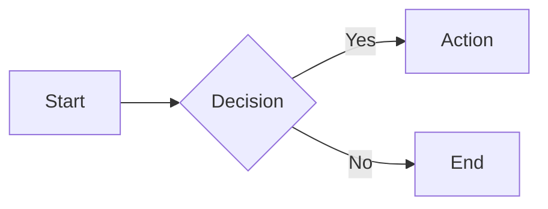
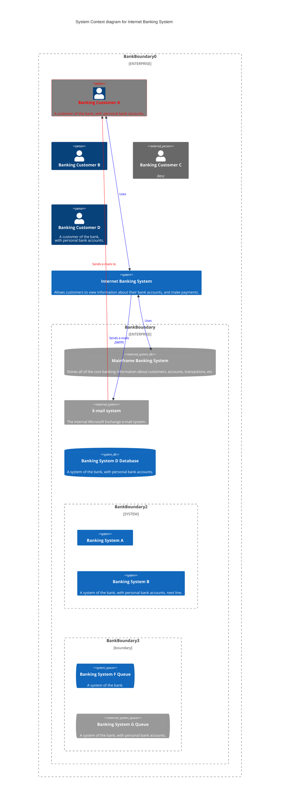

# Architectural Description Document (ADD)

## 1. Introduction
Test

An architectural description shows the system as a multifaceted structure, not just the technical underpinnings of the software. It attempts to communicate understanding the system through multiple viewpoints, like the business, operational, and social perspectives, allowing engineers and architects to craft an architecture that balances various stakeholder needs. By employing this viewpoint-driven approach, the architectural design equips software architects with an approach to designing systems that are not just technically sound, but also aligned with the bigger picture, ensuring stakeholder satisfaction and long-term success.  Although principally intended as a design tool, the architectural description can also provide a means of documenting the system with different views for different stakeholders.

[Help on Markdown language can be found here - https://www.markdownguide.org/ .]: #
[Help on Mermaid (used to create the diagrams) can be found here - https://mermaid.js.org/ .]: #
[Details on C4 models can be found here - https://c4model.com/ .]: #

> _Briefly introduce the system and its purpose_

### Scope

> _State the scope of the architectural description._

### Stakeholders

| Stakeholder Class | Name \ Group            | Business | Functional  | Development | Deployment | Implementation | Evolution | Security | Quality |
| :---              | :---                    |:---:     | :---:       | :---:       | :---:      | :---:          | :---:     | :---:    | :---:   |
| Business Sponsor  | ?                       |✔️         | ✔️        | ❌         | ❌         | ❌              | ✔️      | ✔️       | ✔️     |
| IT Sponsor        | ?                       |✔️         | ✔️        | ❌         | ❌         | ✔️              | ✔️      | ✔️       | ✔️     |
| Users             | ?                       |✔️         | ❌        | ❌         | ❌         | ❌              | ✔️      | ❌       | ❌     |
| Developers        | ?                       |✔️         | ✔️        | ✔️         | ✔️         | ✔️              | ✔️      | ✔️       | ✔️     |
| Suppport Staff    | ?                       |✔️         | ✔️        | ❌         | ❌         | ❌              | ❌      | ✔️       | ✔️     |
| Testers           | ?                       |✔️         | ✔️        | ❌         | ❌         | ❌              | ❌      | ✔️       | ✔️     |
| IT Security       | ?                       |✔️         | ✔️        | ❌         | ❌         | ❌              | ❌      | ✔️       | ✔️     |

## 2. Business Viewpoint

### Goals & Objectives

> _Describe the business goals and objectives that the system is intended to achieve._

### Key Business Processes

> _Identify the key business processes and their relationship to the system. Consider using business process diagrams (see below)._

### Non-Functional Requirements

> _Define the system's non-functional requirements (performance, security, scalability, etc.)._

### Business Constraints And Assumptions

> _Outline the business constraints and assumptions that influence the architecture._

# 3. Functional Viewpoint

## High-Level Architectural Overview

> _Specify the interfaces between the system and its external environment.  Consider usng a C4 context diagram (see below)._

## 4. Element View

> _Describe the system's overall architecture and its high-level components._

* Define the system's main functions and their interactions.
* Identify the data flows and data structures within the system.
* Specify the interfaces between the system and its external environment.

**4.1 The Context Viewpoint**
* Accessibility
    * Is there any requirements for the system to interface with specialist devices for use by people with disabilities?
* Development Resource
    * Are there any resource constraints (short timescales / Limitations on available skills / etc)?   
* Regulation
    * Are there any requirements to interface with internal or external auditing or regulatory reporting systems.
    
**4.2 The Functional Viewpoint**
* Development Resource
    * Are there any resource constraints that could impose restrictions on functionality and on functional qualities such as generality?    
* Regulation
    * What impact does the regulation (if any) have on what the system does and how it works?

**4.3 The Information Viewpoint**
* Development Resource  
    * Is there any requirement for specialists’ staff?
    * Is there a requirement for a larger than normal team?
* Regulation
    * What regulation are there which relate to the retention, use and manipulation of personal information? 
    * Will any of the following be required of the personal information? 
        * Privacy, Access control, Retention and archive, Audit, Availability, Distribution

    
**4.4 The Concurrency Viewpoint**
* Development Resource  
    * How much time will be required for Development?
    * How much time will be required for Testing?

**4.5 The Development Viewpoint**
* Development Resource
    *   Are there any cost constraints? 

**4.6 The Deployment Viewpoint**
* Development Resource
    *   Are there any cost constraints? 

**4.7 The Operational Viewpoint**
* Development Resource
    * What are the cost implications of the proposed operational and support architecture?

* Regulation
    * Are there any specific operational tools and processes required to manage and oversee regulatory reporting activities?

**10. Appendix**

* Include additional supporting documentation, such as diagrams, prototypes, and code snippets.
* Reference relevant standards, guidelines, and architectural patterns used in the design.
* Provide glossaries of terms and acronyms used throughout the document.
