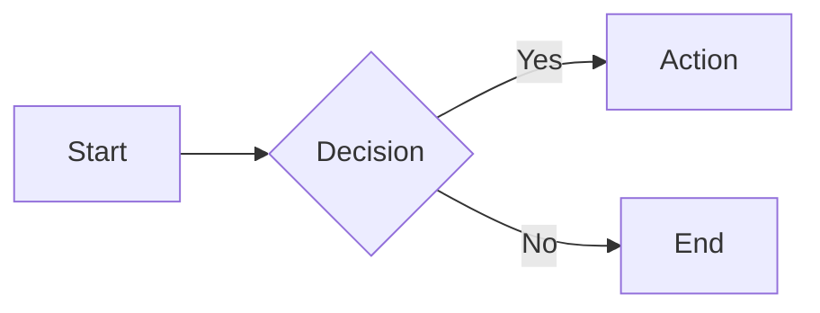
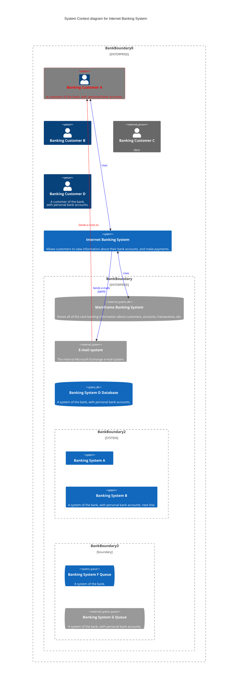

# Architectural Description Document (ADD)

## 1. Introduction

An architectural description shows the system as a multifaceted structure, not just the technical underpinnings of the software. It attempts to communicate understanding the system through multiple viewpoints, like the business, operational, and social perspectives, allowing engineers and architects to craft an architecture that balances various stakeholder needs. By employing this viewpoint-driven approach, the architectural design equips software architects with an approach to designing systems that are not just technically sound, but also aligned with the bigger picture, ensuring stakeholder satisfaction and long-term success.  Although principally intended as a design tool, the architectural description can also provide a means of documenting the system with different views for different stakeholders.

[Help on Markdown language can be found here - https://www.markdownguide.org/ .]: #
[Help on Mermaid (used to create the diagrams) can be found here - https://mermaid.js.org/ .]: #
[Details on C4 models can be found here - https://c4model.com/ .]: #

> _Briefly introduce the system and its purpose_

### Scope

> _State the scope of the architectural description._

### Stakeholders

| Stakeholder Class | Name \ Group            | Business | Functional  | Development | Deployment | Implementation | Evolution | Security | Quality |
| :---              | :---                    |:---:     | :---:       | :---:       | :---:      | :---:          | :---:     | :---:    | :---:   |
| Business Sponsor  | ?                       |✔️         | ✔️        | ❌         | ❌         | ❌              | ✔️      | ✔️       | ✔️     |
| IT Sponsor        | ?                       |✔️         | ✔️        | ❌         | ❌         | ✔️              | ✔️      | ✔️       | ✔️     |
| Users             | ?                       |✔️         | ❌        | ❌         | ❌         | ❌              | ✔️      | ❌       | ❌     |
| Developers        | ?                       |✔️         | ✔️        | ✔️         | ✔️         | ✔️              | ✔️      | ✔️       | ✔️     |
| Suppport Staff    | ?                       |✔️         | ✔️        | ❌         | ❌         | ❌              | ❌      | ✔️       | ✔️     |
| Testers           | ?                       |✔️         | ✔️        | ❌         | ❌         | ❌              | ❌      | ✔️       | ✔️     |
| IT Security       | ?                       |✔️         | ✔️        | ❌         | ❌         | ❌              | ❌      | ✔️       | ✔️     |

## 2. Business Viewpoint

### Goals & Objectives

> _Describe the business goals and objectives that the system is intended to achieve._

### Key Business Processes

> _Identify the key business processes and their relationship to the system. Consider using business process diagrams (see below)._

### Non-Functional Requirements

> _Define the system's non-functional requirements (performance, security, scalability, etc.)._

### Business Constraints And Assumptions

> _Outline the business constraints and assumptions that influence the architecture._

## 3. Functional Viewpoint

### Functional Capabilities

> Specify that capabilites of the system, what is the system required to do and potentailly what is the system not required to do

### High-Level Architectural Overview

> _Specify the interfaces between the system and its external environment.  Consider usng a C4 context diagram (see below)._

### Internal Structure

> Describe the design philosophy of the system. Is it micro-services, a monolith, commodity middleware? Useful to extend this to provide security to technical teams that the system is being built to common standards/best practice, but don't detail these will be covered elsewhere

### Component View

> _Describe the system's overall architecture and its high-level components._

## 4. Development Viewpoint

### Module Organisation
> Describe the "modules" that make up the codebase, modules here meaning logical units within the code e.g. DB persistence or configuration
todo - Diagram 

### Common Processing
> Outline any commonalities both within and without the system. Are there any utilitiy modules, any frameworks/tooling the system relise on

### Standadisation of Design
> The coding standards that apply to this system. Think of the needs/costs of maintatinability, reliability and technical cohesion

### Standardisation of Testing
> The testing standards that apply to this system. Think of the applicability of the layers of the testing pyramid and supporting infrastructure like tooling or subs/mocks

### Codeline Organization
> Set out how the repo(s) will be structured and why that structure is being used

### Quality Measuring
> Outline the mechanisms for measuring and tracking system quality, testing quality as well as the code quality

### Addressing Quality
> Define the process for addressing known quality issues and defects

## 5. Deployment Viewpoint

### Runtime Platform Required
> The deployed view of the system and the type of resrouces needed. May be different between environements, but should include compute modules, storage, DBs, etc
todo - diagram

### Specification of Runtime Platform
> Outlines the exact specification needed for each Runtime, this may not be needed if this is documented in IaC code but you may include reasoning here

### Third-party Requirements
> Are there any third party requirements that will affect the deployed system

### Technology Compatability
> Any requirements that we impart onto the deployed system, does this system use a .Net version that is out of the ordinary or a DB library that needs to be configured

### Network Requirements
> Where applicable, are there any requirements on the network of the deployed system

### Network Capcaity Required
> Not likely to be an issue for resrouces that live in the cloud, but are there any systems/dependencies that will produce load that needs to be condiered for the overal network capacity

## 6. Evolution Viewpoint

### Adaptability Considerations
> Describe the system's adaptability and scalability to meet future needs

### Expected Growth
> Identify the potential growth areas and performance requirements for the future

### End-of-life Consideration
> Outline when the current system might become unfit for purpose and the migration stratege

### In-life Rework
> Document the process for addressing potential architectural changes and modifications to the system

## 7. Security Viewpoint

### Adherance to Policy
> Describe the security requirements, policies, and measures implemented in the system

### Known Attack Surfaces
> Identify potential security threats and vulnerabilities and their mitigations

### Attack Management 
> Document the procedures for managing security incidents and breaches.

## 8. Appendix

> Include additional supporting documentation, such as diagrams, prototypes, and code snippets.
> Reference relevant standards, guidelines, and architectural patterns used in the design.
> Provide glossaries of terms and acronyms used throughout the document.
